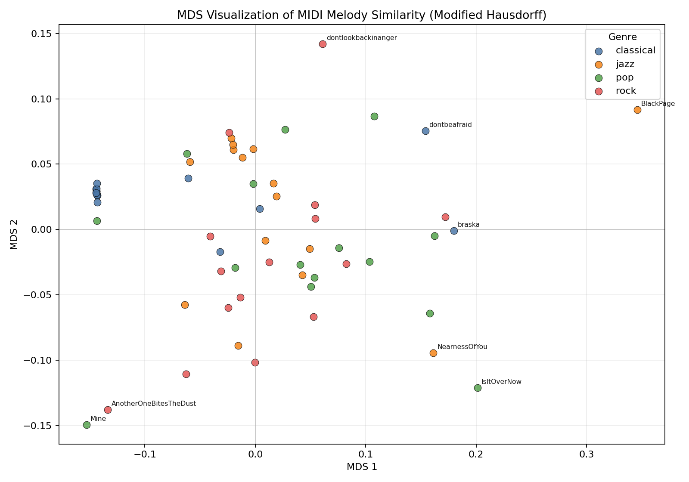

# 基于旋律线几何距离的曲风相似性分析报告

## 1. 实验目的

本实验旨在验证“旋律线几何距离”是否能够在一定程度上区分不同曲风。实验将 MIDI 音乐片段抽象为三维曲线：

```text
时间 x、音高 y、力度 z
```

然后使用 Modified Hausdorff 距离计算不同音乐片段之间的旋律线几何差异，并进一步比较同曲风内部距离与不同曲风之间距离。如果不同曲风之间的平均距离明显大于同曲风内部平均距离，则说明该几何度量方法具有一定曲风区分能力。

## 2. 数据集

实验数据来自本地目录：

```text
data/midi_dataset_v1.0/data/raw
```

共包含 4 个曲风类别：

| 曲风 | 文件数 |
|---|---:|
| classical | 15 |
| jazz | 15 |
| pop | 15 |
| rock | 15 |

总计 60 个 MIDI 文件。所有文件均成功解析，无加载失败样本。

## 3. 数据预处理

MIDI 文件可能包含多个音轨、伴奏、低音、和弦或鼓点。为减少伴奏声部对主旋律分析的干扰，本实验采用以下策略：

1. 对每个 MIDI 文件合并所有可解析音轨。
2. 对同一时间点的多个音符，仅保留最高音。
3. 将得到的音符序列作为旋律线点集。

每个音符被表示为：

```text
Note = (timestamp, pitch, velocity)
```

归一化方式如下：

| 维度 | 归一化方法 |
|---|---|
| 时间 | 每条曲线减去自身起始时间后除以自身总时长 |
| 音高 | MIDI 音高除以 127 |
| 力度 | MIDI 力度除以 127 |

归一化后，每首歌被映射为单位立方体中的三维旋律曲线。

## 4. 距离计算方法

本实验使用 Modified Hausdorff 距离。相比标准 Hausdorff 距离，Modified Hausdorff 将最大最近邻距离替换为平均最近邻距离，因此对离群点更加稳健。

对于两条旋律点集 \(A\) 和 \(B\)，定义：

```text
h(A, B) = mean_a min_b ||a - b||
```

则 Modified Hausdorff 距离为：

```text
H_m(A, B) = max(h(A, B), h(B, A))
```

对 60 首歌曲两两计算距离，得到 60 x 60 距离矩阵。

## 5. 曲风平均距离矩阵

对同一曲风内部的所有歌曲对求平均，得到对角线数值；对不同曲风之间的所有歌曲对求平均，得到非对角线数值。

| 曲风 | classical | jazz | pop | rock |
|---|---:|---:|---:|---:|
| classical | 0.1249 | 0.1686 | 0.1814 | 0.1697 |
| jazz | 0.1686 | 0.1342 | 0.1405 | 0.1429 |
| pop | 0.1814 | 0.1405 | 0.1381 | 0.1378 |
| rock | 0.1697 | 0.1429 | 0.1378 | 0.1390 |

其中：

- 对角线表示同曲风内部平均距离。
- 非对角线表示不同曲风之间平均距离。

统计结果：

| 指标 | 数值 |
|---|---:|
| 同曲风内部平均距离 | 0.1341 |
| 不同曲风之间平均距离 | 0.1568 |
| 不同曲风 / 同曲风 距离比值 | 1.170 |

该结果说明，不同曲风之间的平均距离整体高于同曲风内部距离，当前方法具有一定曲风区分能力。

## 6. 同曲风内部距离分析

| 曲风 | mean | median | min | max | std |
|---|---:|---:|---:|---:|---:|
| classical | 0.1249 | 0.1127 | 0.0209 | 0.3335 | 0.1045 |
| jazz | 0.1342 | 0.1072 | 0.0198 | 0.4397 | 0.0966 |
| pop | 0.1381 | 0.1122 | 0.0452 | 0.3637 | 0.0753 |
| rock | 0.1390 | 0.1212 | 0.0415 | 0.3495 | 0.0652 |

从均值看，classical 内部平均距离最小，说明该类别在当前旋律线几何特征下内部一致性较强。rock 和 pop 的内部距离略高，说明其内部样本差异更大。

## 7. 不同曲风之间距离分析

| 曲风对 | mean | median | min | max | std |
|---|---:|---:|---:|---:|---:|
| classical-jazz | 0.1686 | 0.1411 | 0.0633 | 0.4729 | 0.0891 |
| classical-pop | 0.1814 | 0.1762 | 0.0357 | 0.3825 | 0.0856 |
| classical-rock | 0.1697 | 0.1535 | 0.0439 | 0.3599 | 0.0659 |
| jazz-pop | 0.1405 | 0.1259 | 0.0281 | 0.5656 | 0.0764 |
| jazz-rock | 0.1429 | 0.1218 | 0.0235 | 0.5384 | 0.0784 |
| pop-rock | 0.1378 | 0.1223 | 0.0371 | 0.3719 | 0.0663 |

不同曲风之间，classical-pop 的平均距离最大，说明 classical 与 pop 在当前三维旋律线特征下差异最明显。pop-rock 的平均距离最低，并且接近 pop 和 rock 各自的内部距离，说明这两类曲风在当前特征空间中较难区分。

## 8. MDS 可视化分析

为直观观察曲风分布，本实验对 60 x 60 距离矩阵进行 MDS 二维降维。MDS 会尽量保持原始距离关系，将每首歌映射为二维空间中的一个点。

可视化图像如下：



图中：

- 每个点表示一首 MIDI 歌曲。
- 点的颜色表示曲风类别。
- 点之间越近，说明旋律线几何距离越小。
- 点之间越远，说明旋律线几何差异越大。

MDS 中心距离如下：

| 曲风对 | 中心距离 |
|---|---:|
| classical-jazz | 0.1088 |
| classical-pop | 0.1272 |
| classical-rock | 0.1034 |
| jazz-pop | 0.0334 |
| jazz-rock | 0.0429 |
| pop-rock | 0.0305 |

从 MDS 图和中心距离可以看出：

1. classical 与其他曲风之间的距离相对更大。
2. pop、rock、jazz 三类之间存在明显重叠。
3. pop-rock 的中心距离最小，说明这两类在当前特征与距离方法下最接近。
4. 图中存在若干离群点，例如 `BlackPage`、`Mine`、`AnotherOneBitesTheDust`，这些样本与大多数歌曲的几何旋律特征差异较大。

## 9. 最近与最远歌曲对

距离最近的歌曲对主要来自同一曲风：

| 距离 | 歌曲 A | 歌曲 B |
|---:|---|---|
| 0.0198 | jazz: BlackMountainRag | jazz: Dying |
| 0.0204 | jazz: BlackMountainRag | jazz: Chinatawn |
| 0.0209 | classical: Cids | classical: thenightmarebegins |
| 0.0209 | classical: dayafter | classical: thenightmarebegins |
| 0.0219 | classical: dayafter | classical: decisive |

距离最远的歌曲对主要涉及离群样本：

| 距离 | 歌曲 A | 歌曲 B |
|---:|---|---|
| 0.5656 | jazz: BlackPage | pop: Mine |
| 0.5384 | jazz: BlackPage | rock: AnotherOneBitesTheDust |
| 0.4737 | jazz: BlackPage | rock: Creep |
| 0.4729 | classical: thenightmarebegins | jazz: BlackPage |
| 0.4729 | classical: costadsol | jazz: BlackPage |

## 10. 结论

实验结果表明，基于三维旋律线和 Modified Hausdorff 距离的几何方法能够捕捉一定程度的曲风差异。不同曲风之间的平均距离为 0.1568，高于同曲风内部平均距离 0.1341，距离比值为 1.170。

但是，该方法的曲风区分能力仍然有限。MDS 可视化显示，classical 与其他曲风相对更容易区分，而 pop、rock、jazz 三类样本存在明显重叠。这说明仅依靠时间、音高、力度三维旋律线的几何距离，难以充分表达曲风差异。

总体而言，该方法可以作为曲风相似性分析的基础几何度量，但若要进一步提升曲风分类效果，还需要加入节奏、和声、结构、乐器编配等更丰富的音乐特征。

## 11. 后续改进方向

1. **加入节奏特征**  
   当前时间维度只表示音符出现位置，尚未显式建模节奏型、音符时值和重音结构。

2. **加入和声特征**  
   不同曲风常具有不同和弦进行与和声密度，仅分析旋律线会遗漏这部分信息。

3. **加入结构特征**  
   可分析主歌、副歌、重复段落和变奏结构，从宏观层面刻画曲风。

4. **主旋律轨道自动识别**  
   当前使用合并轨道最高音线作为近似主旋律，后续可基于轨道名称、音域、音符密度自动推荐主旋律轨道。

5. **多距离指标对比**  
   可进一步比较标准 Hausdorff、Modified Hausdorff、离散 Fréchet、DTW 等方法对曲风区分效果的影响。

## 12. 输出文件

本次实验生成的结果文件包括：

```text
results/genre_distance_matrix_modified.csv
results/genre_load_summary.csv
results/mds_coordinates_modified.csv
results/mds_genre_modified.png
```
