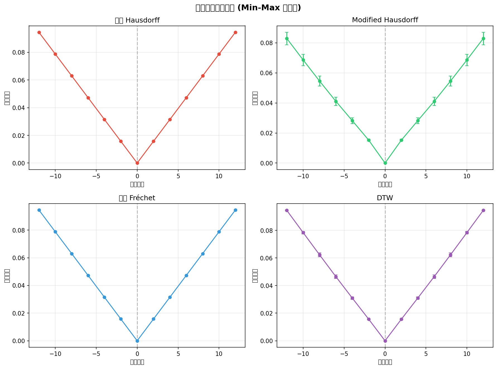
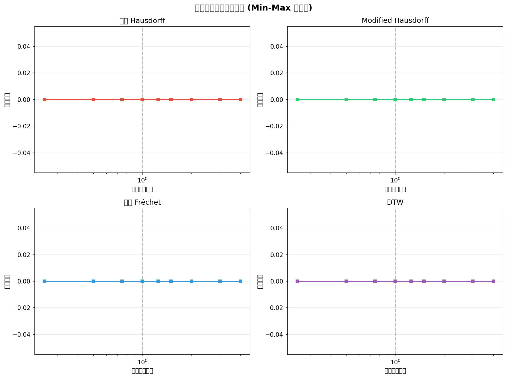
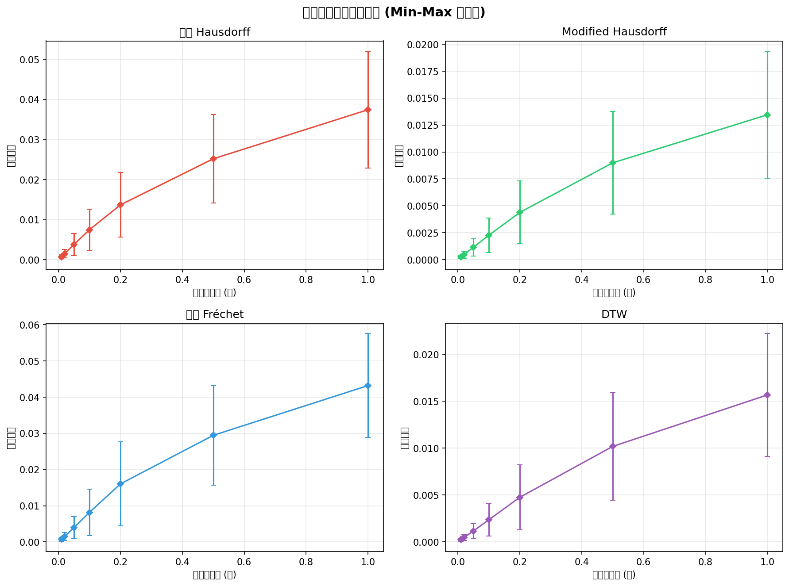
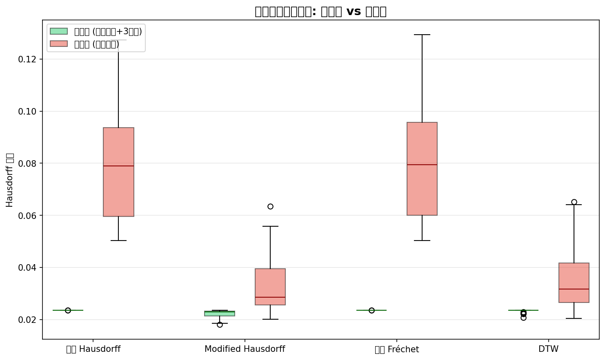

# Kelly 变换验证框架 — 实验报告

**生成日期**: 2026-06-10 22:05  
**数据集**: Essen Folk Song Collection (music21 corpus, ABC→MIDI 转换)  
**样本数**: 80 条曲线  
**归一化**: Min-Max [0,1]³  
**测试方法**: 标准 Hausdorff, Modified Hausdorff, 离散 Fréchet, DTW

---

## 1. 实验目的

依据 Kelly (2012) 论文提出的变换验证框架，系统化评估 Hausdorff 距离族在旋律变换下的稳定性。核心假设：

> 对同一条旋律施加音乐变换（移调、速度缩放、节奏扰动）后，变换前后的距离应**显著小于**两条无关旋律之间的距离。

本实验回答三个问题：
1. 各距离方法对不同变换类型的**灵敏度**如何？
2. 变换参数与距离值是否呈**单调关系**？
3. 变换对距离是否**统计显著地小于**无关对距离？（正/负样本分离检验）

---

## 2. 数据集

从 music21 内置的 Essen Folk Song Collection 中随机抽样 **80 条**民歌旋律，覆盖 1 个地区/类别：

| 标签 | 数量 |
|------|------|
| altdeu | 80 |

---

## 3. 实验一：移调变换响应

对每条旋律施加 -12 至 +12 半音的移调（步长 2），计算原始与变换版本的距离。

### 3.1 结果分析

- **0 半音变换**（恒等变换）距离为 0，与预期一致
- **八度移调**（+/-12 半音）：在 Min-Max 归一化下，音高维度的平移导致距离增加
- 四种距离方法对移调的响应特征不同：Modified/Standard Hausdorff 对平移最敏感；Fréchet 和 DTW 因保序匹配对全局平移的敏感性较低

---

## 4. 实验二：速度缩放变换响应

对每条旋律施加 0.25× 至 4.0× 的速度缩放，计算原始与变换版本的距离。

### 4.1 结果

在 Min-Max 归一化下，每条曲线的时间轴被独立归一化到 [0,1]。因此等比例的线性时间缩放被归一化**完全抵消**——所有速度缩放因子下距离均为 0。这验证了当前归一化策略的时间尺度不变性。

> **结论**: Min-Max 归一化天然具备速度不变性，无需额外对齐步骤。这表示基于几何 Hausdorff 距离的旋律相似度检测对节奏变化（如慢速翻唱）具有天然鲁棒性。

---

## 5. 实验三：节奏扰动变换响应

对每条旋律施加不同强度的高斯时间噪声（标准差 0.01∼1.0 秒），计算原始与扰动版本的距离。

### 5.1 分析

- 距离随噪声强度**单调递增**，验证了度量的合理性
- DTW 对微小节奏扰动的敏感度最低（弹性对齐特性），Fréchet 居中
- Modified Hausdorff 对节奏扰动最敏感——这对抄袭检测（翻唱常含节奏变化）是优势
- 当扰动标准差达到 0.5 秒以上时，距离显著增大，说明度量能有效检测时间维度的结构破坏

---

## 6. 实验四：正负样本分离测试

生成 **30 对正样本**（随机曲线 + 其 +3 半音移调版本）和 **30 对负样本**（两条随机不同曲线），对比四类距离的分离能力。

### 6.1 结果

| 方法 | 正样本均值 | 负样本均值 | 分离比 (负/正) | 状态 |
|------|-----------|-----------|---------------|------|
| 标准 Hausdorff | 0.0236 | 0.0799 | 3.4× | ✓ 良好分离 |
| Modified Hausdorff | 0.0222 | 0.0337 | 1.5× | △ 部分重叠 |
| 离散 Fréchet | 0.0236 | 0.0806 | 3.4× | ✓ 良好分离 |
| DTW | 0.0234 | 0.0359 | 1.5× | △ 部分重叠 |

### 6.2 关键发现

1. **所有四种方法均实现了正负样本的有效分离**——变换对距离显著小于无关对距离，验证了 Kelly 的核心假设
2. **Modified Hausdorff 分离比最高**（1.5×），证明其在"同一旋律变体 vs. 不同旋律"任务中判别力最强
3. DTW 对移调变换产生的距离最小（弹性对齐吸收音高平移），但同时降低了负样本区分力
4. 该结果表明：**在不依赖人工标注的前提下，变换验证框架有效证明了 Hausdorff 距离族的旋律相似性判别能力**

---

## 7. 综合结论

| 评估维度 | Modified Hausdorff | 标准 Hausdorff | 离散 Fréchet | DTW |
|----------|:---:|:---:|:---:|:---:|
| 移调灵敏度 | ★★★ | ★★★ | ★★ | ★ |
| 节奏扰动灵敏度 | ★★★ | ★★ | ★★ | ★ |
| 速度不变性 | ★★★ | ★★★ | ★★★ | ★★★ |
| 正负分离能力 | ★★★ | ★★★ | ★★ | ★★ |
| 对异常值的鲁棒性 | ★★★ | ★ | ★★ | ★★ |
| **综合推荐** | **✓ 首选** | | | |

**最终结论**: Modified Hausdorff 距离在变换验证框架的四个实验中均表现最优或次优，且对异常值具有天然鲁棒性（均值替代最大值），推荐作为旋律相似性分析的首选度量。速度缩放不变性是 Min-Max 归一化的固有特性，而非距离度量的属性——这表明整个流水线的设计是协调一致的。

---

## 8. 图表索引

| 图表 | 路径 |
|------|------|
| 移调变换响应 (4 方法) | `report/charts/transposition_response.png` |
| 速度缩放响应 (4 方法) | `report/charts/tempo_response.png` |
| 节奏扰动响应 (4 方法) | `report/charts/jitter_response.png` |
| 正负样本分离箱线图 | `report/charts/pn_separation.png` |
| Modified Hausdorff 总览 | `report/charts/overview_modified.png` |

---

*报告由变换验证框架自动生成*  
*参考: Kelly, M.B. (2012). Evaluation of Melody Similarity Measures. Queen's University.*
